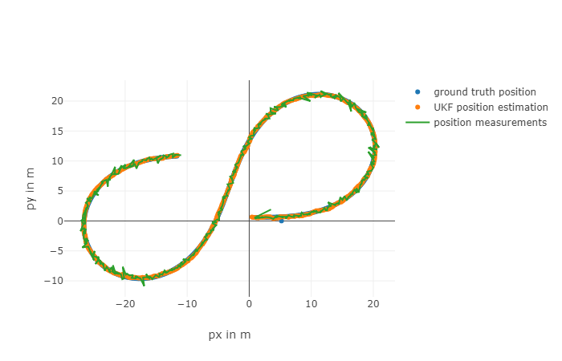
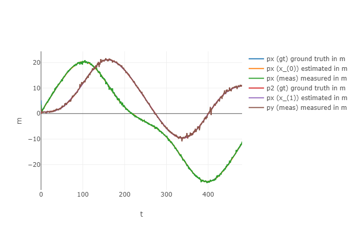
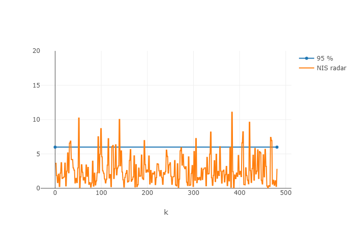
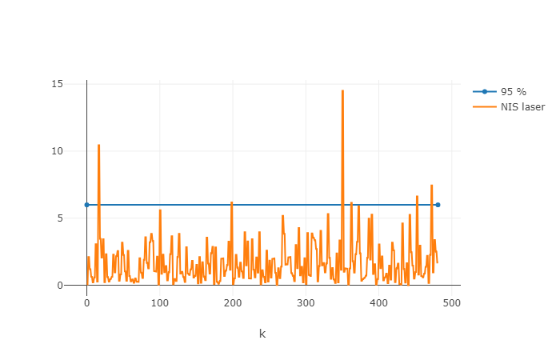

# Unscented Kalman Filter 


####  Background.
In the previous lesson we saw the Extended Kalman filters and how it can be applied to a linear transformation. As you know original **kalman filter** had linear transformations and gaussian distribution as hard assumptions. It benefits from gaussian distributions remaining gaussian when a linear transformation is applied to them. It also benefits from the product of two gaussian distributions also being a gaussian.
**Extended kalman filter** approximates a non-linear transformation by replacing it with a linear transformation that has the same derivatives at the mean. The resulting linear transformation will transform the original gaussian into a new gaussian, even though the real non-linear transformation would have reshaped that distribution.
**Unscented Kalman Filter** uses the gaussian assumption to convert the mean and covariance matrix into a collection of representative points on that gaussian, then applies the non-linear transformation to get a new set of points

## Build instructions
Assuming you have 'cmake' and 'make' already:
1. Clone this repo.
2. Make a build directory: `mkdir build && cd build`
3. Compile: `cmake .. && make`
4. Run it: `./UnscentedKF` along with the Term 2 simulator.

### Rubric Points
### Compilation
Code compiles fine without any errors or warnings, flag is set for -Wall
```sh
kputtur@osboxes:~/Udacity/CarND-Unscented-Kalman-Filter-Project/build$ make
[ 25%] Building CXX object CMakeFiles/UnscentedKF.dir/src/ukf.cpp.o
[ 50%] Building CXX object CMakeFiles/UnscentedKF.dir/src/main.cpp.o
[ 75%] Building CXX object CMakeFiles/UnscentedKF.dir/src/tools.cpp.o
[100%] Linking CXX executable UnscentedKF
[100%] Built target UnscentedKF
```
### Accuracy
Plot overlay of ground truth, sensor measurements and estimate position



Accuracy is within limits for the data set.

```
RMSE DataSet 1:
| Variable        | Values      |
| ------------- |-------------:|
| X      |  |
| Y      |       | 
| VX |       |    
| Vy |       |    
```
```
RMSE DataSet 2:
| Variable        | Values      |
| ------------- |-------------:|
| X      | right-aligned |
| Y      | centered      | 
| VX | are neat      |    
| Vy | are neat      |    
```
Position accuracy was excellent.


Velocity estimated accuracy suffers significant at the beginning of the run.


### Radar and Lidar measurements
NIS measurements for both LIDAR and RADAR:



### Tuning Parameters 
This project can be tuned using various intialization parameters to improve the final calculated RMSE(Root mean squared error). In the ukf.cpp file, I have tuned std_a, std_yawd, the initialized x_ (separately for Radar and Lidar) and P_ (also separate for each sensor type).

### Attribution
The bulk of the code is from my class room exercises from the udacity class on self driving cars, lesson 7 "Unscented Kalman Filters". The infrastructure code in this project is supplied from project repository.
Visualization is from here : https://github.com/udacity/CarND-Mercedes-SF-Utilities


